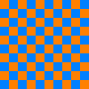
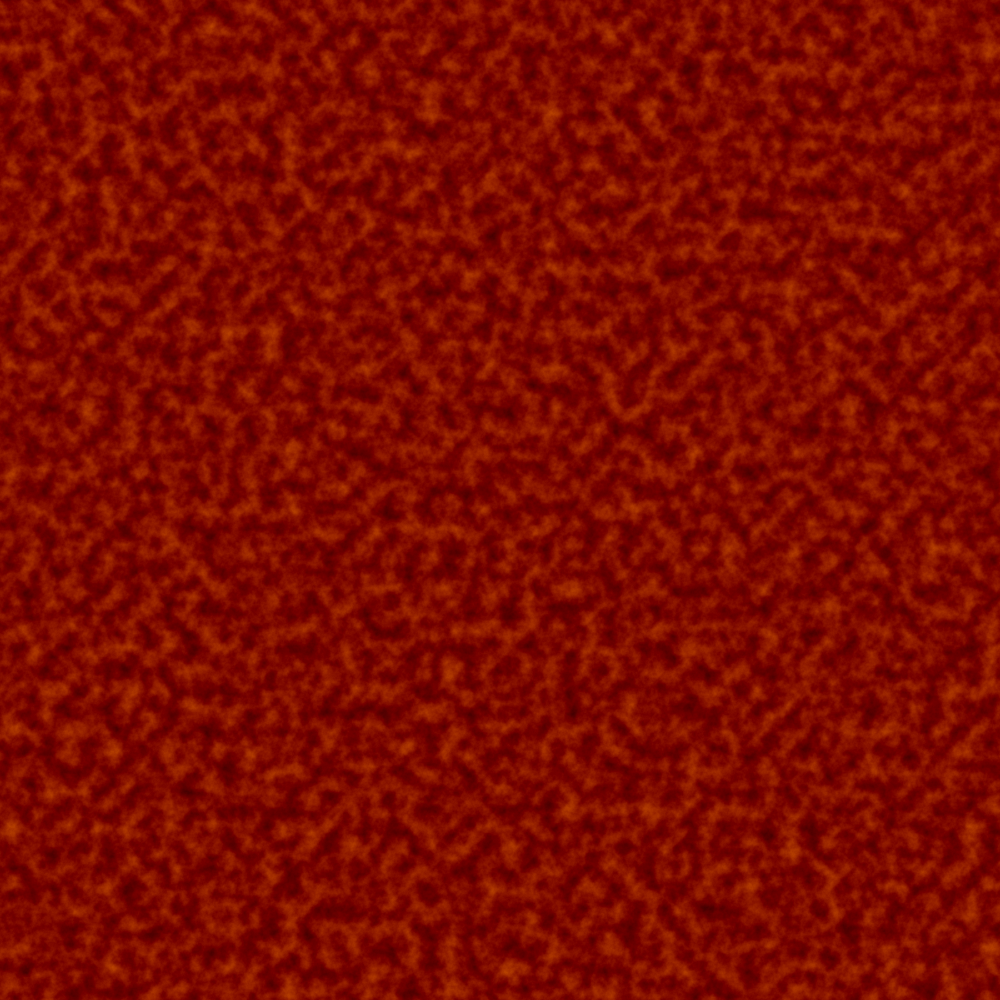
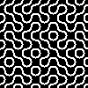
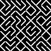

# caldeira

A rust render engine based on Vulkan. Not production ready yet :warning:
For the moment I have a ready compute pipeline, try cargo run with a different compute.comp shader with the same interface,
it will output an image in ./image.png. The display does not work at this time. 

# Examples
* A checkerboard :

* A fire generated with perlin noise :

* Truchet pattern with circles :

* Truchet pattern with maze :

# Thanks
I adapted Perlin's algorithm for the Perlin noise, and I transposed code from https://vulkan-tutorial.com/.
I use https://github.com/ash-rs/ash for binding with Vulkan.
